# Job Hunter with Hermes

An autonomous job-search agent system I designed and operate for my own PM/PMM/growth job hunt — built as a product, documented like one.

Every morning at 7:30am it sources new roles from tiered sources (HN Who's Hiring, Built In NYC, Wellfound, seeded career pages), scores each against a written rubric with hard caps, and sends me a ranked Telegram digest. For every role I signal interest in, a backgrounder run builds a company one-pager, then a package builder produces a tailored ATS-safe resume and cover letter — with every bullet traceable to a master resume it is never allowed to exceed. It never auto-submits. I submit, it learns from my edits and from outcomes, and it reweights its own rubric every Sunday with stated rationale.

I built this system because the scarce resource in a job search is the candidate's judgment, and I wanted judgment spent on decisions, not on copy-pasting job descriptions into resumes at 1am.

## Why a product manager built this

I'm an MBA candidate pivoting from 8 years in media and brand strategy to product management. This repo *is* my PM case study, and it's built the way I believe products should be:

- **A PRD with real tradeoffs** — goals, non-goals, and guardrails that each exist because of a named failure mode. `docs/PRD.md`
- **Judgment encoded as specs** — the scoring rubric, ATS rules, and anti-hallucination constraints are written down, versioned, and auditable. They are the product; the scripts just execute them. `docs/`
- **A learning loop** — weekly calibration that reads reply rates, my edit-diffs on drafts, and recorded outcomes, then reweights the rubric with rationale. It doesn't learn from vibes.
- **Honest failure modes** — the padding ban ("a short list is honest; padding is poison"), the never-pad quota, no-catch-up cron, and a digest that reports *why* on empty days.

## Architecture

```mermaid
flowchart LR
    S["Daily sourcing run<br/>(tiered, time-boxed)"] --> R["Weighted rubric scoring<br/>+ hard caps"]
    R --> D["Ranked Telegram digest<br/>(top 10, watchlist pinned)"]
    D --> H["Human triage: int / go / skip<br/>(~3 min)"]
    H --> B["Account backgrounder<br/>(company one-pager, cached)"]
    B --> P["Package builder: ATS resume .docx<br/>+ cover letter, humanizer pass"]
    P --> M["Manual submission<br/>- never automated"]
    M --> L["Outcome intel + edit-diff signals"]
    L --> C["Weekly rubric calibration<br/>(versioned, rationale stated)"]
    C -.-> R
    style H fill:#f9f9f9,stroke:#333,stroke-width:2px
    style P fill:#eef6e9,stroke:#4a7c3a
```

Full component diagram and design notes: `docs/architecture.md`

## What's in this repo

| Path | What it is | PM lens |
|---|---|---|
| `docs/PRD.md` | Product requirements: problem, goals, users, P0/P1/P2, guardrails | The way I scope before building |
| `docs/architecture.md` | System architecture with diagram + component notes | System design and integration choices |
| `docs/operating-spec.md` | The authoritative daily/weekly routine the agent follows | Operational spec as a product artifact |
| `docs/scoring-rubric.md` | Weighted 0–10 fit scoring with hard caps and routing thresholds | Judgment written down, not vibes |
| `docs/ats-rules.md` | ATS-safe document + keyword rules, learned from real parser behavior | Domain research → enforceable rules |
| `docs/resume-writing-design-standard.md` | Writing formula + design tokens + the mandatory anti-AI-tell humanizer scan | Quality bar, programmatically enforced |
| `docs/cover-letter-templates.md` | Three positioning angles with anti-patterns | Positioning thinking |
| `docs/account-backgrounder-template.md` | Company one-pager template that feeds the package builder | Research templates |
| `docs/target-watchlist.md` | Priority companies and mandatory-check rules | Prioritization |
| `docs/user-manual.md` | The one-page operator's manual | Docs I'd write for any user |
| `code/jobbot_helpers.py` | ATS-safe markdown→docx generator + Telegram document delivery | The execution layer |
| `code/make_resume_pdf.py` | Designed one-page PDF resume generator with auto-scale + hard one-page enforcement | Constraints as code |

**Not included (deliberately):** my master resume, tailored drafts, application tracker, and daily digests — those contain personal data and real applications. What's published is the *method*: every spec, template, rubric, and script, scrubbed of instance data. Metrics (roles processed, hours saved, reply rates) will be published here once the system has accumulated a meaningful baseline — the repo is v1-live, not retrospective.

## Guardrails worth reading

The rules that make this system trustworthy are in the PRD, but the short version:

1. **Never auto-submits.** The system packages; the human submits.
2. **Never invents experience.** Every bullet traces to the master resume.
3. **Never pads.** Fewer than 10 qualifying roles → honest short digest, with reasons.
4. **No LinkedIn scraping, no browser automation in v1.**
5. **Mandatory humanizer scan** on every draft before it ships.

## Built with

[Hermes Agent](https://hermes-agent.nousresearch.com/) (isolated `jobs` profile, cron-triggered runs) · Python · python-docx · fpdf2 · Telegram Bot API · a very large cup of coffee

## Status

v1 live since September 2026, processing roles daily. Built and operated by [Achyuth Chirravuri](https://www.linkedin.com/in/achyuthchirravuri) — 8 years in media/brand strategy, currently an MBA candidate at Fordham Gabelli, targeting PM/PMM/growth roles.