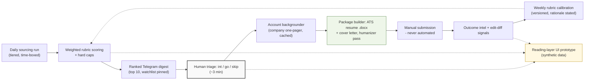

# Junter

An autonomous job-search engine + reading-layer UI prototype. Operated
daily by Achyuth Chirravuri for his own PM/PMM/growth role hunt — built
as a product, documented like one.

Every morning at 7:30am the engine sources new roles from tiered sources
(HN Who's Hiring, Built In NYC, Wellfound, seeded career pages), scores
each against a written rubric with hard caps, and sends a ranked
Telegram digest. For every role the operator signals interest in, a
backgrounder run builds a company one-pager, then a package builder
produces a tailored ATS-safe resume and cover letter — every bullet
traceable to a master resume it is never allowed to exceed. It never
auto-submits. The operator submits; the engine learns from edits and
outcomes, and reweights its own rubric every Sunday with stated
rationale.

On top of the engine sits a **reading-layer UI prototype** — a single-page
HTML/CSS/JS application that turns the tracker.csv + digests + cron state
into 8 inspectable screens (Pipeline Board, Deadline Rail, Focus, Daily
Digest, Role Detail, Run Health, Rubric & Calibration, Telegram Mirror).
The UI is synthetic-data only by design — real application state never
leaves the operator's machine; the UI is the *demonstration* of the
reading layer, not the live surface.

## Why a product manager built this

I'm an MBA candidate pivoting from 8 years in media and brand strategy
to product management. This repo *is* my PM case study, and it's built
the way I believe products should be:

- **A PRD with real tradeoffs** — goals, non-goals, and guardrails that
  each exist because of a named failure mode. `docs/PRD.md`
- **Judgment encoded as specs** — the scoring rubric, ATS rules, and
  anti-hallucination constraints are written down, versioned, and
  auditable. They are the product; the scripts just execute them. `docs/`
- **A learning loop** — weekly calibration reads reply rates, edit-diffs
  on drafts, and recorded outcomes, then reweights the rubric with
  rationale. It doesn't learn from vibes.
- **A reading layer** — an 8-screen UI prototype that exposes the
  system's behavior. The UI is synthetic-data-only; the value is in
  showing the system *thinks out loud*, not in launching a tracker app.
- **Honest failure modes** — the padding ban ("a short list is honest;
  padding is poison"), the never-pad quota, no-catch-up cron, a digest
  that reports *why* on empty days, and a truth-notice on the Focus
  page when soft gates are used.

## Architecture

The engine (`engine/`) does the work. The UI prototype (`ui/`) reads
the engine's outputs through the snapshot exporter (`snapshot-export/`)
and renders them. Full component diagram and design notes:
`docs/architecture.md`.

## What's in this repo

### Engine layer

| Path | What it is | PM lens |
|---|---|---|
| `docs/PRD.md` | Product requirements: problem, goals, users, P0/P1/P2, guardrails | The way I scope before building |
| `docs/architecture.md` | System architecture with diagram + component notes | System design and integration choices |
| `docs/operating-spec.md` | The authoritative daily/weekly routine the agent follows | Operational spec as a product artifact |
| `docs/scoring-rubric.md` | Weighted 0–10 fit scoring with hard caps and routing thresholds | Judgment written down, not vibes |
| `docs/ats-rules.md` | ATS-safe document + keyword rules, learned from real parser behavior | Domain research → enforceable rules |
| `docs/resume-writing-design-standard.md` | Writing formula + design tokens + the mandatory anti-AI-tell humanizer scan | Quality bar, programmatically enforced |
| `docs/cover-letter-templates.md` | Three positioning angles with anti-patterns | Positioning thinking |
| `docs/account-backgrounder-template.md` | Company one-pager template that feeds the package builder | Research templates |
| `docs/target-watchlist.md` | Priority companies and mandatory-check rules | Prioritization |
| `docs/user-manual.md` | The one-page operator's manual | Docs I'd write for any user |
| `engine/jobbot_helpers.py` | ATS-safe markdown→docx generator + Telegram document delivery | The execution layer |
| `engine/make_resume_pdf.py` | Designed one-page PDF resume generator with auto-scale + hard one-page enforcement | Constraints as code |
| `engine/scoring.py` | Weighted rubric scorer with hard caps, routing bands, sponsorship detection | Judgment-as-code |
| `engine/synth_demo.py` | Offline demo: emits `out/{README.md, score.txt, resume.docx, gates.json}` | Reproducible engineering scaffold |
| `engine/yaml.py` | Stdlib-only YAML subset so workflow self-parse works without PyYAML | Dependency minimization |

### UI prototype layer (synthetic data only)

> **Try the prototype:** it's a static SPA with no build step. Because
> `ui/app.js` `fetch()`es `synthetic-data/seed.json` by relative path,
> open it over a static server rooted at the **repo root** (not `ui/`):
> `python3 -m http.server 8765` then visit
> `http://localhost:8765/ui/index.html`. Opening `ui/index.html`
> directly, or serving from `ui/`, makes the fetch 404 and the app falls
> back to its inline dataset — still fully functional, just not reading
> the seed. No install is required. A hosted demo URL will be linked
> here once the deploy lands.
>
> **Live Figma wireframes:** [figma.com/design/e4kzWfgPUTchpIcuv1o7Y6](https://www.figma.com/design/e4kzWfgPUTchpIcuv1o7Y6)

| Path | What it is |
|---|---|
| `ui/index.html` | SPA shell with hash routing (`#/pipeline`, `#/deadline`, `#/focus`, `#/digest`, `#/role/<id>`, `#/run-health`, `#/rubric`, `#/telegram`) |
| `ui/styles.css` | All values are `var(--space-*)` / `var(--text-*)` / `var(--color-*)` tokens from `docs/ui-design-tokens.md` — zero hard-coded literals for sizes and colors |
| `ui/app.js` | Reads `synthetic-data/seed.json` via `fetch()`; falls back to inline FALLBACK if the fetch fails or the seed contains PII tokens (defense in depth). `normalizeState()` adapts the exporter's output shape (`pipeline`/`deadline_rail`/`role_detail`/`run_health`) onto the screens' shape (`roles`/`cron_runs`/`rubric_diff`), so the UI renders a real exporter snapshot — not just the seed — without changing the exporter's schema |
| `ui/tests/test_app.py` | PII-guard tests, route-rendering tests, design-token compliance, and adapter tests (runs the real `ui/app.js` in Node against a DOM stub) |
| `synthetic-data/generate.py` | Deterministic seed generator (seed=42 → byte-identical output). 50 fictional roles across 5 status columns, 3+ deadlines, 1+ rejected per reason; names the six watchlist companies (Google, Microsoft, Amazon, Adobe, MongoDB, Meta) as fictional stand-ins so the demo Pipeline Board and Deadline Rail are demonstrable |
| `synthetic-data/seed.json` | The generated seed (88 KB) |
| `snapshot-export/export.py` | Reads `tracker.csv` + `digests/` + `cache/companies/` OR `synthetic-data/` (env var `JUNTER_DATA_DIR`) and emits a single JSON the UI consumes. Parse-defensively — bad rows are warnings, not exceptions |
| `docs/ui-design-tokens.md` | The canonical design-token spec; CSS in `ui/styles.css` is a 1:1 mirror of these tokens |
| `docs/ui-stage-0.md` | The problem-definition brief behind the UI prototype (the reframe from "build a tracker app" to "build the reading layer on top of the engine") |
| `docs/ui-pm-reasoning.md` | The PM reasoning behind every screen: the framing problem, the three bets (deadline-first, score explainability, refusal-to-pad), the screen-by-screen JTBD, the trade-offs accepted, the things I'd do differently next time. **The read-this-first document for a recruiter.** |
| `docs/ui-evidence/` | Before/after screenshots documenting the Figma polish (T5) and HTML sync (T6): 8 Figma-before + 3 Figma-after + 4 HTML-after PNGs, ~1.7 MB. See `docs/ui-evidence/README.md` for the index. |

**Not included (deliberately):** the operator's master resume, tailored
drafts, application tracker, daily digests, and Telegram credentials —
those contain personal data and real applications. What's published is
the *method*: every spec, template, rubric, and script, plus a
fully-functional reading-layer UI prototype running against synthetic
data. Metrics (roles processed, hours saved, reply rates) will be
published here once the system has accumulated a meaningful baseline.

## Guardrails worth reading

The rules that make this system trustworthy are in the PRD, but the
short version:

1. **Never auto-submits.** The system packages; the human submits.
2. **Never invents experience.** Every bullet traces to the master
   resume.
3. **Never pads.** Fewer than 10 qualifying roles → honest short
   digest, with reasons.
4. **No LinkedIn scraping, no browser automation in v1.**
5. **Mandatory humanizer scan** on every draft before it ships.
6. **Synthetic data only in the UI.** Real application state never
   touches the public repo; the UI prototype defends against accidental
   PII inclusion with a hardcoded token-blocklist.

## Evidence matrix — what this repo actually ships

The repo describes an end-to-end system. This table separates what the
published code and tests *demonstrate* from what is *specified as
orchestration* in `docs/` but only partially executed by the public
code, and from what is *future work*. Nothing in the matrix is invented.
Every row maps to a file or test that exists in this repository.

| Area | Status | Evidence (file or test) |
|---|---|---|
| ATS-safe markdown→docx generator | Implemented in code, tested | `engine/jobbot_helpers.py`, `engine/tests/` |
| One-page PDF resume with hard page-1 gate | Implemented in code, tested | `engine/make_resume_pdf.py`, `engine/tests/test_pdf_layout.py` (15 tests) |
| Weighted 0–10 fit scoring with hard caps + routing | Implemented in code, tested | `engine/scoring.py`, `engine/tests/test_scoring.py` (23 tests) |
| Synthetic demo that emits `out/{README.md, score.txt, resume.docx, gates.json}` | Implemented in code, runs offline | `engine/synth_demo.py` |
| Stdlib YAML subset for workflow self-parse | Implemented in code, offline | `engine/yaml.py` |
| HTML/CSS/JS reading-layer UI prototype (8 screens) | Implemented in code, runs offline against `synthetic-data/seed.json` | `ui/index.html`, `ui/styles.css`, `ui/app.js` |
| Design-token compliance for the UI prototype | Tokens defined in `docs/ui-design-tokens.md`; CSS mirrors them 1:1 | `ui/styles.css` `:root` block; `ui/tests/test_app.py` |
| Snapshot exporter (engine tracker.csv → UI JSON) | Implemented in code, tested with both synthetic and real-data paths | `snapshot-export/export.py`, `snapshot-export/tests/test_export.py` |
| Deterministic synthetic seed generator | Implemented in code, byte-identical across runs (seed=42) | `synthetic-data/generate.py`, `synthetic-data/seed.json` |
| PII guard on the UI (inline + seed file check) | Implemented in code, tested | `ui/app.js` (PII_TOKENS blocklist), `ui/tests/test_app.py` |
| **Sourcing adapters** (HN, Built In, Wellfound, career-page polling) | Specified in docs only; **not in this repo** | `docs/operating-spec.md` (sections "Sources", "Daily run") — orchestrator code lives in the operator's private `jobs` profile |
| **Telegram digest delivery** | Specified in docs; delivery client is in the operator's private profile | `docs/operating-spec.md` ("Tailoring & delivery mechanics") |
| **Weekly rubric calibration** with stated rationale | Specified in docs; calibration script lives in the operator's private profile | `docs/operating-spec.md` ("Weekly calibration"), `docs/scoring-rubric.md` |
| **Account backgrounder** (company one-pager cache, 30-day reuse) | Specified in docs; implementation in operator's private profile | `docs/operating-spec.md` ("Account backgrounder", "Company intelligence cache") |
| **ATS keyword rules + humanizer scan** | Specified in docs; scanner lives in operator's private profile | `docs/ats-rules.md`, `docs/resume-writing-design-standard.md` |
| **Edit-diff learning** from operator's manual edits | Specified; not in this repo | `docs/PRD.md` ("System behavior & guardrails — Edit-diff learning") |
| **Outcome metrics dashboard** | Future work | `docs/PRD.md` ("P2 — Metrics dashboard") |
| **Config-driven source adapters** so anyone can run it | Future work | `docs/PRD.md` ("P2") |
| **Portal-question analysis** (`qs <id>`) | Future work / partial — spec only | `docs/PRD.md` ("P1 — partial"), `docs/operating-spec.md` ("Portal questions") |

The repo is honest about this split: the **method** (specs, rubric,
templates, the engine + scoring + tests, the reading-layer UI prototype,
and the snapshot exporter with its tests) is public; the **live
execution** (daily sourcing, Telegram transport, calibration, and any
real network call) stays in the operator's private `jobs` profile
because it carries secrets and the operator's real tracker.

## Built with

[Hermes Agent](https://hermes-agent.nousresearch.com/) (isolated `jobs`
profile, cron-triggered runs) · Python · python-docx · fpdf2 · Telegram
Bot API · vanilla HTML/CSS/JS (no build step for the UI) · a very large
cup of coffee

## Status

v1 live since September 2026, processing roles daily. UI prototype
landed in October 2026 (this repo). Built and operated by
[Achyuth Chirravuri](https://www.linkedin.com/in/achyuthchirravuri) —
8 years in media/brand strategy, currently an MBA candidate at Fordham
Gabelli, targeting PM/PMM/growth roles starting May/June 2027.
