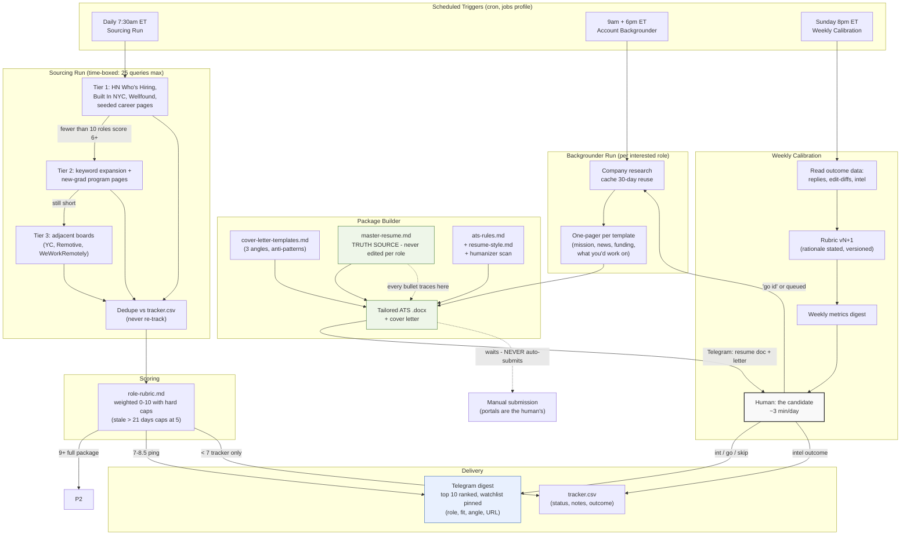

# Architecture

The system is a single-operator pipeline: three cron-triggered runs on a Hermes Agent profile, connected by files on disk (tracker, cache, drafts) and a Telegram command interface. The human is a component — deliberately in the loop at every decision point.

## Component notes

**File bus, not a database.** The tracker CSV, company cache, and drafts folder are the integration layer. Boring on purpose: inspectable, greppable, and diffable by the human at any time.

**Truth-source discipline.** `master-resume.md` is the only source of resume facts. Tailored drafts draw from it exclusively — the system never writes new claims, only re-selects and re-orders. This is the anti-hallucination control.

**Guardrails as first-class components.** "Never auto-submit," "never pad the digest," "no LinkedIn scraping," and the mandatory humanizer scan are encoded in the operating spec and enforced in the run, not aspirational values.

**The learning loop.** Weekly calibration reads real signals: reply rates by tier, edit-diffs on drafts (what the human changed is what they consider truthful), and recorded outcomes. It reweights the rubric only with stated rationale, keeping a version trail.

**Why cron + agent, not a server.** One operator, one laptop, near-zero cost. The failure mode (asleep Mac = missed run, no catch-up) is accepted for v1 rather than adding infrastructure.