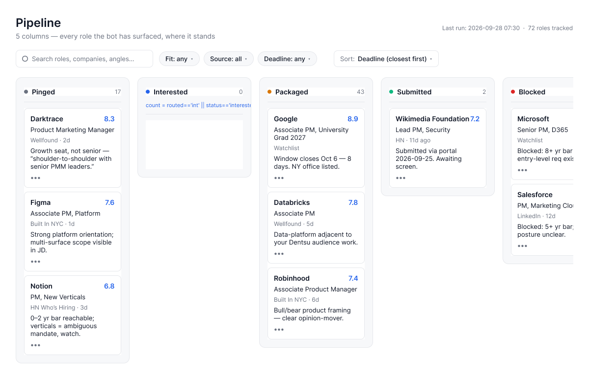
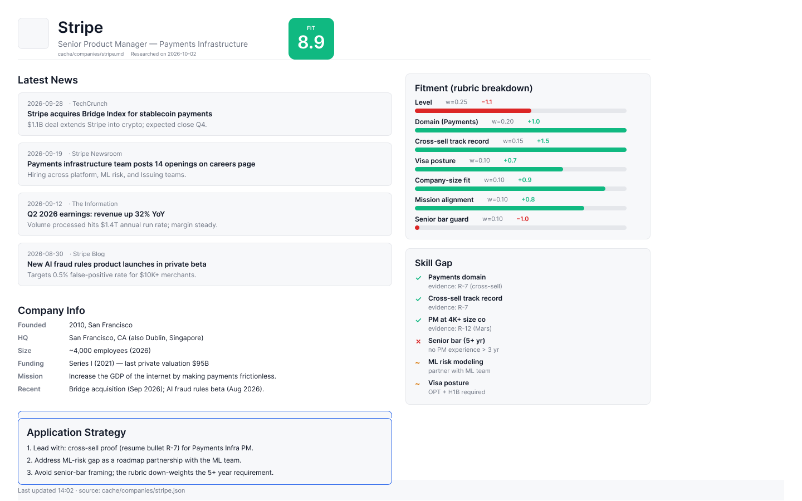
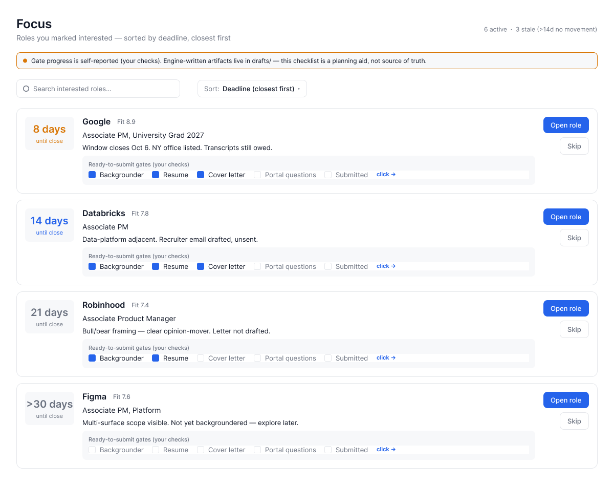
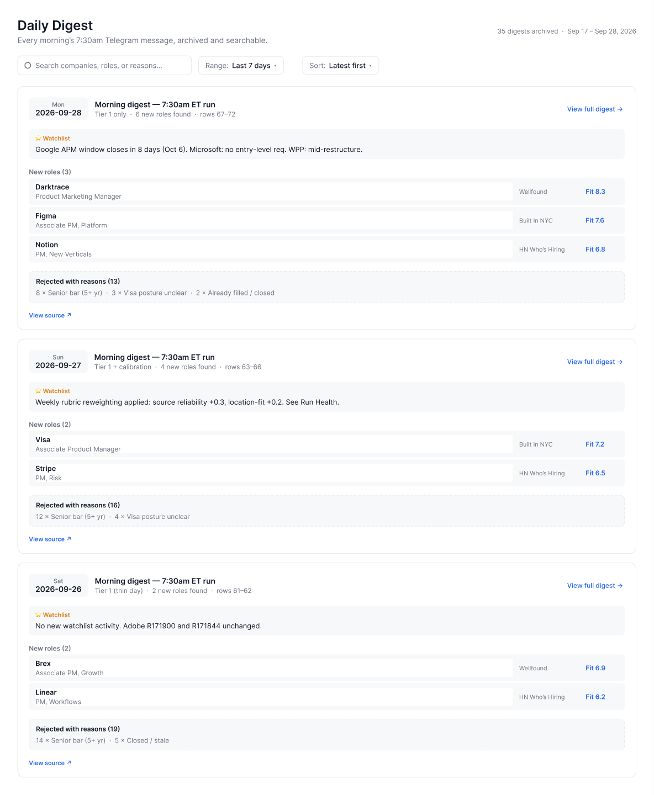
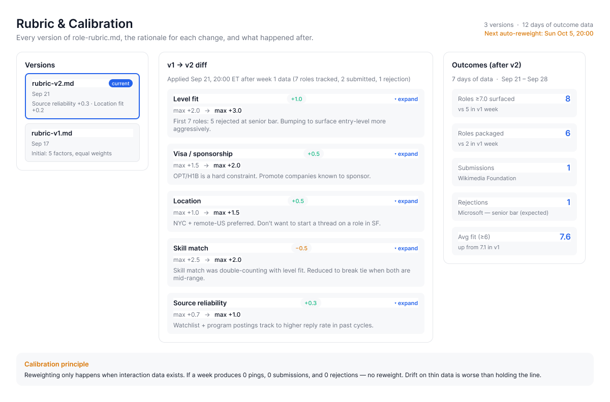

# Junter public-preview refactor

## Summary

This PR turns Junter’s recruiter-facing surface into a clearer synthetic-data product demo: the system’s deadline-first workflow, calibration logic, run health, source coverage, and research loop are visible across eleven screens. The reference spec is [docs/refactor-spec-2026-10-03.md](refactor-spec-2026-10-03.md); the prior UX audit is [docs/junter-ui-analysis-2026-10-02.md](junter-ui-analysis-2026-10-02.md).

It adds the Account Backgrounder as the richest screen, strengthens the main UI and its evidence, and brings Job Boards and Research Hub into the shared navigation. The implementation also includes an action contract, optimistic UI behavior, and a Telegram adapter that targets the same endpoint rather than creating a second write path.

This PR is deliberately held for manual review. Local verification passes, but production persistence and a live public write surface are not being claimed: the server action path fails closed on Vercel until a durable, transactional, isolated backend is approved and configured. The public deployment must remain synthetic and read-only; no personal tracker data, production replacement, or Telegram activation is part of this PR.

## Screen inventory

1. **Pipeline Board** — groups open synthetic roles across the funnel with a deadline-first new-match row.
2. **Deadline Rail** — makes time-sensitive work visible in urgency tiers with an integrity footer.
3. **Focus** — shows interested work and its gate-by-gate progress.
4. **Daily Digest** — exposes promoted roles and rejected-with-reasons evidence instead of padding.
5. **Run Health** — surfaces run status, cron history, warnings, and freshness.
6. **Rubric & Calibration** — explains scoring versions, changes, and calibration outcomes.
7. **Telegram Mirror** — presents message delivery state as a diagnostic, not a second source of truth.
8. **Role Detail** — provides the per-role fit, history, and decision context.
9. **Account Backgrounder** — combines skill gap, fitment, application strategy, company context, and news; it is intentionally the most visually rich screen.
10. **Job Boards** — summarizes source coverage, deadlines, fit, and routed roles.
11. **Research Hub** — shows calibration history and outcome intelligence.

## Verification

`bash tests/verify/run_all.sh` passed all **7 local gates / 32 tests** on 2026-10-03: Figma parity (5), design tokens (4), PII guard (5), action surface (5), mechanism strengths (5), live-probe logic (4), and visual regression (4). Result: `PRE_DEPLOY=PASS`; `LIVE_ACCEPTANCE=PENDING` until an explicitly authorized target is available and its deployed SHA matches the intended source SHA.

Additional local acceptance recorded by T20: 8 Python handler-harness checks, 12 Node action-handler checks, 84 client checks (with 1 pre-existing skip), and 23 Telegram-adapter checks. These use local mocks and are not presented as deployed evidence.

## Screenshots

## Delivery lineage

- T17: refactor specification
- T18: Figma refresh and evidence
- T19: Account Backgrounder
- T20: shared action surface and Telegram adapter
- T21: pre-deploy verification suite
- T6: Job Boards
- T7: synthetic data preparation
- T8: Research Hub and CI gates

## Review notes

- Keep this branch review-only; do not merge automatically.
- Do not deploy with `vercel --prod`: authorization covers an isolated synthetic preview only and explicitly excludes production replacement.
- Any future action round trip requires a protected, isolated transactional backend and separate live verification.
